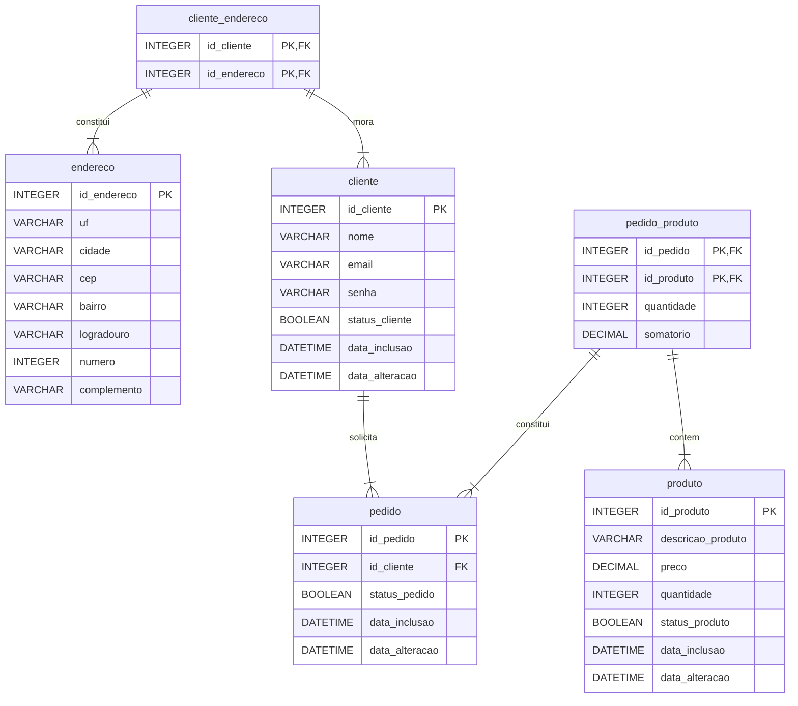

# Levantamento de requisitos

## Regras de Negócio

- Todo cliente precisa ter um email e senha para gerar um pedido; (NOT null)

- O cliente pode ter mais de um endereço de entrega; (n:m)

- Cliente pode ter mais de um pedido; (1:n)

- Um pedido pode conter mais de um produto e um produto pode constituir mais de
  um pedido; (n:m)

- Pedido precisa ter um status;

## Interface

- Será necessário um tela para modificar o status do pedido;

- Será necessário tela de consulta de todos os pedidos do cliente;

- A visualização do pedido deverá ter cabeçalho com os dados do cliente, dados
  de entrega e a listagem dos itens com a somatória de todos;

- Administração para manutenção de cadastro dos produtos, manutenção de
  cadastro de clientes, consultar os pedidos e possibilidade para modificar;

- Relatório por período de tempo para consultar a soma de pedidos por dia (Soma
  de quantidade e soma de valor). Ex. 22/10/2024 a 23/10/2024

| Data       | Quantidade | Total      |
|:-:         |:-:         |:-:         |
| 22/08/2024 |  5         | R$   320,0 |
| 22/08/2024 | 10         | R$ 1.500,0 |
| 23/08/2024 |  8         | R$   710,0 |
| Total      | 23         | R$ 2.530,0 |

# Modelo Lógico

- endereco: id\_endereco (PK), uf, cidade, cep, bairro, logradouro, numero,
  complemento;

- cliente: id\_cliente (PK), nome, email, senha, status\_cliente,
  data\_inclusao, data\_alteracao;

- cliente\_endereco: id\_cliente (PK,FK), id\_endereco (PK,FK);

- produto: id\_produto (PK), descricao\_produto, preco, quantidade,
  status\_produto, data\_inclusao, data\_alteracao;

- pedido: id\_pedido (PK), id\_cliente (FK), somatorio, status\_pedido,
  data\_inclusao, data\_alteracao;

- pedido\_produto: id\_pedido (PK,FK), id\_produto (PK,FK), quantidade,
  somatorio.

# Diagrama de Entidade-Relaciomaneto



# Entidade endereco
| Coluna       | Tipo    | Tamanho   | Complemento                    | Descricao                                 |
|--------------|---------|-----------|--------------------------------|-------------------------------------------|
| id\_endereco | INTEGER |   4 bytes | PK, auto\_increment            | Código de identificação do endereco.      |
| uf           | CHAR    |   2 bytes | NOT null                       | Unidade Federativa, estado.               |
| cidade       | VARCHAR |  50 bytes | NOT null                       | Cidade onde se encontra o local.          |
| cep          | VARCHAR |   8 bytes | NOT null, UNIQUE (cep, numero) | Código de Endereçamento Postal.           |
| bairro       | VARCHAR |  50 bytes | NOT null                       | Nome de identificação do bairro.          |
| logradouro   | VARCHAR |  50 bytes | NOT null                       | Logradouro, nome de identificação rua.    |
| numero       | VARCHAR |   8 bytes | NOT null, UNIQUE (cep, numero) | Número de identificação da propriedade.   |
| complemento  | VARCHAR | 255 bytes | NOT null                       | Valor composto pelo Bairro, Rua e Número. |

# Entidade cliente
| Coluna          | Tipo     | Tamanho   | Complemento                | Descricao                               |
|-----------------|----------|-----------|----------------------------|-----------------------------------------|
| id\_cliente     | INTEGER  |   4 bytes | PK, auto\_increment        | Código de identificação do cliente.     |
| nome            | VARCHAR  |  50 bytes | NOT null                   | Nome e sobrenome do cliente.            |
| email           | VARCHAR  | 255 bytes | NOT null, UNIQUE           | E-mail utilizado para cadastro.         |
| senha           | VARCHAR  | 100 bytes | NOT null                   | Senha de segurança para login.          |
| status\_cliente | BOOLEAN  |   1 bytes | DEFAULT true               | Status ativação de cadastro do cliente. |
| data\_inclusao  | DATETIME |   3 bytes | DEFAULT current\_timestamp | Data em que o cliente foi cadastrado.   |
| data\_alteracao | DATETIME |   3 bytes | null                       | Data em que o registro foi alterado.    |

# Entidade cliente\_endereco
| Coluna       | Tipo    | Tamanho | Complemento      | Descricao                                       |
|--------------|---------|---------|------------------|-------------------------------------------------|
| id\_cliente  | INTEGER | 4 bytes | PK, FK, NOT null | Código de identificação do cliente que mora.    |
| id\_endereco | INTEGER | 4 bytes | PK, FK, NOT null | Código de identificação do endereco que contem. |

# Entidade produto
| Coluna             | Tipo     | Tamanho  | Complemento                | Descricao                             |
|--------------------|----------|----------|----------------------------|---------------------------------------|
| id\_produto        | INTEGER  |  4 bytes | PK, auto\_increment        | Código de identificação do produto.   |
| descricao\_produto | CHAR     | 50 bytes | NOT null                   | Descrição do produto em questão.      |
| preco              | DECIMAL  |  5 bytes | NOT null                   | Preço do produto, ex. R$12.345,67     |
| quantidade         | INTEGER  |  4 bytes | DEFAULT 1                  | Quantidade de produtos em estoque.    |
| status\_produto    | BOOLEAN  |  1 bytes | DEFAULT true               | Status de disponibilidade de produto. |
| data\_inclusao     | DATETIME |  3 bytes | DEFAULT current\_timestamp | Data em que o produto foi incluído.   |
| data\_alteracao    | DATETIME |  3 bytes | null                       | Data em que o produto foi alterado.   |

# Entidade pedido
| Coluna       | Tipo    | Tamanho | Complemento                    | Descricao                           |
|--------------|---------|---------|--------------------------------|-------------------------------------|
| id\_pedido      | INTEGER  | 4 bytes | PK, auto\_increment        | Código de identificação do pedido.  |
| id\_cliente     | INTEGER  | 4 bytes | FK, NOT null               | Código de identificação do cliente. |
| status\_pedido  | BOOLEAN  | 1 bytes | DEFAULT true               | Status de andamento do pedido.      |
| data\_inclusao  | DATETIME | 3 bytes | DEFAULT current\_timestamp | Data em que o pedido foi realizado. |
| data\_alteracao | DATETIME | 3 bytes | null                       | Data em que o pedido foi alterado.  |

# Entidade pedido\_produto
| Coluna      | Tipo    | Tamanho | Complemento      | Descricao                           |
|-------------|---------|---------|------------------|-------------------------------------|
| id\_pedido  | INTEGER | 4 bytes | PK, FK, NOT null | Código de identificação do pedido.  |
| id\_produto | INTEGER | 4 bytes | PK, FK, NOT null | Código de identificação do produto. |
| quantidade  | INTEGER | 4 bytes | DEFAULT 1        | Quantidade de unidades solicitada.  |
| somatorio   | DECIMAL | 5 bytes | NOT null         | Multiplicação (preco x quantidade). |

# Best Practices

## One Item Per Line

"This could be one elemento in your select statement or one condition in a join
statement or one case statement."

## Commenting Code

"While code is a language and if proficient in the language, a reader can
understand *what* the code is doing. But the code *never* tells the reader
*why* someone wanted to code to function that way."

## Common Table Expressions (CTE)

"Common table expressions or CTE are a way of creating an in-memory table of
your query results. This table can then be used throughout the rest of your SQL
script. The benefit to using a CTE is that you can resduce the duplication,
make your code more readable, and increase your ability to perform QA checks on
your results."

"A common table expression, or CTE, is atemporary named result set created from
a simple 'SELECT' statement that can be used in a subsequent 'SELECT'
statement. Each SQL CTE is like a named query, whose result is store in a
virtual table (a CTE) to be referenced later in the main query. CTEs are
particularly useful for breaking down complex queries into more manageable
parts."

"The CTE starts with the 'WITH' keyword, after which you specify the name of
your CTE, then the content of the query in parentheses. The mains query comes
after the closing parenthesis and referst to the CTE."

## Aliasing

"Aliasing is very important to help readers understand where elements reside
and what tables are being used. This makes the code very readable for the end
user. Even if you only have a single table it is a good practice to use an
alias on the table and field name."

# Snippets
```sql
SELECT * FROM INFORMATION_SCHEMA.COLUMNS WHERE TABLE_NAME = N'Table_Name';
```

# Referencias
- [Mermaid Chart](https://www.mermaidchart.com/play)
- [MySQL](https://www.mysql.com/)
- [Workbench](https://www.mysql.com/products/workbench/)
- [SQL Best Practices](https://medium.com/@BrandonSouthern/sql-best-practices-e1c61e96ee27)
- [WITH (Common Table Expressions)](https://dev.mysql.com/doc/refman/9.0/en/with.html)
- [SQL Style Guide](https://www.sqlstyle.guide/)
